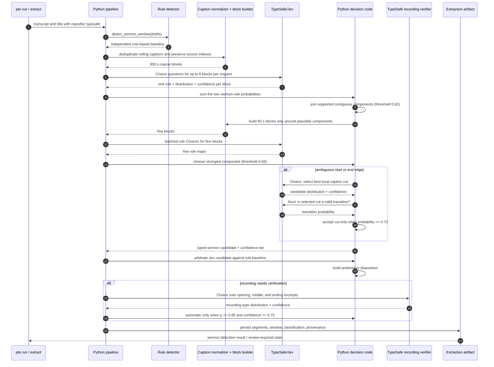

# TypeSafe AI in Sermon Detection

This project uses TypeSafe AI's Jev model for small, typed semantic judgments;
Python owns transcript processing, candidate construction, thresholds, interval
selection, persistence, and fallback behavior. Jev does not generate a sermon
summary or directly write a start and end time.

The normal Jev-first path is enabled with:

```bash
pte run \
  --classifier typesafe \
  --recording-verifier-backend typesafe \
  --recording-verifier-model jev-1.13.0 \
  --base-dir /path/to/app-data
```

The examples below are illustrative, shortened payloads. The field names,
question shapes, choices, and decision rules match the implementation.

## End-to-end sequence



## 1. Prepare semantic transcript blocks in code

Caption feeds commonly overlap or repeat text. Before any model call, the
pipeline normalizes nearby rolling-caption fragments while retaining a lossless
mapping back to original transcript segment indexes. It creates:

- coarse blocks: approximately 300 seconds, at most 9,000 characters;
- fine blocks: approximately 60 seconds, at most 3,200 characters; and
- local edge candidates: cuts between original, deduplicated transcript
  segments, not model-invented timestamps.

Only the coarse stage sees the complete recording. Fine blocks are restricted to
the coarse sermon-like regions plus a 300-second buffer on each side.

## 2. Coarse role map: a batch of Choice questions

The request state contains the title and up to six numbered blocks. Each
question targets exactly one block, while sharing the same role definitions.

```json
{
  "state": {
    "recording_title": "Hope That Does Not Disappoint",
    "blocks": [
      {"block_id": 0, "text": "Welcome... Please stand as we sing..."},
      {"block_id": 1, "text": "Turn with me to Romans 5. Paul is showing us..."},
      {"block_id": 2, "text": "...because suffering produces endurance... Let us pray."}
    ]
  },
  "questions": {
    "block_0": {
      "kind": "Choice",
      "instructions": {"task": "Classify the dominant role of blocks[0].text."},
      "criteria": ["principal_sermon", "sermon_integrated_prayer_or_scripture", "worship_music_or_service_prayer", "administration_or_transition", "childrens_or_religious_education", "unclear"]
    },
    "block_1": {"kind": "Choice", "instructions": {"task": "Classify blocks[1].text using the same criteria."}},
    "block_2": {"kind": "Choice", "instructions": {"task": "Classify blocks[2].text using the same criteria."}}
  }
}
```

The SDK response is read as a choice, a probability map, a confidence value,
and the resolved model ID. For each block, code derives
`sermon_probability` by adding the probabilities for
`principal_sermon` and `sermon_integrated_prayer_or_scripture`.

```json
{
  "model": "jev-1.13.0",
  "choices": {
    "block_0": {
      "choice": "worship_music_or_service_prayer",
      "probabilities": {"worship_music_or_service_prayer": 0.97, "principal_sermon": 0.01},
      "confidence": 0.94
    },
    "block_1": {
      "choice": "principal_sermon",
      "probabilities": {"principal_sermon": 0.93, "sermon_integrated_prayer_or_scripture": 0.03, "administration_or_transition": 0.02},
      "confidence": 0.88
    },
    "block_2": {
      "choice": "sermon_integrated_prayer_or_scripture",
      "probabilities": {"sermon_integrated_prayer_or_scripture": 0.76, "principal_sermon": 0.16, "worship_music_or_service_prayer": 0.04},
      "confidence": 0.79
    }
  }
}
```

In this example, blocks 1 and 2 have sermon probabilities of 0.96 and 0.92.
They clear the coarse threshold of 0.62 and form a contiguous candidate
component. Code may bridge one short, contiguous ambiguous block when its
sermon probability is at least 0.40 or Jev chose `unclear`.

## 3. Fine role map and interval selection

The pipeline repeats the same narrow Choice judgment only for 60-second blocks
inside the plausible coarse range. It keeps contiguous blocks whose derived
sermon probability is at least 0.66, then ranks components in code:

```text
component score = mean sermon probability × log2(duration seconds + 1)
```

For a selected component, the resulting detection artifact has a concrete
interval and source-segment index list:

```json
{
  "method": "typesafe_first_v11",
  "confidence_tier": "high",
  "retained_segment_indexes": [41, 42, 43, 44, 45],
  "search": {
    "selected_rank": 1,
    "candidates": [{
      "source": "typesafe_first",
      "start_seconds": 612.4,
      "end_seconds": 2487.8,
      "score_components": {
        "mean_sermon_probability": 0.89,
        "start_transition_strength": 0.86,
        "end_transition_strength": 0.84,
        "competing_component_ratio": 0.18
      }
    }]
  }
}
```

High confidence requires all of the following: mean sermon probability at least
0.82, start and end transition strengths at least 0.72, and at least 600 seconds
of retained material. Medium confidence requires mean probability at least 0.72
and duration at least 300 seconds. A substantial second component downgrades the
result: ratio at least 0.45 prevents high confidence; ratio at least 0.75 forces
low confidence.

## 4. Ambiguous-edge refinement: Choice, then Noul

The pipeline asks for edge refinement only when an edge is weak or material
sermon probability appears just outside it. Code derives possible cuts from a
bounded local neighborhood (up to five blocks / 180 seconds), then sends a
closed-set Choice question.

```json
{
  "state": {"recording_title": "Hope That Does Not Disappoint", "edge": "end"},
  "questions": {
    "boundary": {
      "kind": "Choice",
      "instructions": {"task": "Choose the single best end boundary for the principal worship-service sermon, or no_clear_boundary."},
      "criteria": {
        "end:2487.800": {"before_boundary_ends": "...let us close in prayer.", "after_boundary_begins": "Thank you, Pastor. The choir will now..."},
        "end:2513.100": {"before_boundary_ends": "...the choir will now sing...", "after_boundary_begins": "Please join us for refreshments..."},
        "no_clear_boundary": "None of the candidate cuts clearly shows the required semantic transition."
      }
    }
  }
}
```

```json
{
  "choices": {
    "boundary": {
      "choice": "end:2487.800",
      "probabilities": {"end:2487.800": 0.91, "end:2513.100": 0.05, "no_clear_boundary": 0.04},
      "confidence": 0.87
    }
  }
}
```

Selection alone does not move the boundary. Jev receives a second, binary Noul
judgment for the selected cut:

```json
{
  "state": {
    "recording_title": "Hope That Does Not Disappoint",
    "edge": "end",
    "before_boundary": "...let us close in prayer.",
    "after_boundary": "Thank you, Pastor. The choir will now..."
  },
  "questions": {
    "valid_boundary": {
      "kind": "Noul",
      "instructions": {"statement_to_evaluate": "before_boundary completes the principal message and after_boundary begins a distinct service activity."},
      "criteria": {"true": "The cut retains the integrated conclusion and places a new service element after it.", "false": "The message continues, starts too late, or no semantic handoff occurs."}
    }
  }
}
```

```json
{
  "nouls": {"valid_boundary": {"noul": 0.91}},
  "model": "jev-1.13.0"
}
```

Only a validation probability of at least 0.72 accepts the refined cut. Otherwise
the pipeline retains the fine-block boundary and records the attempted refinement.

## 5. Arbitration, recording verification, and safe fallback

The conventional rule detector still runs first as an independent baseline.
After a usable Jev interval is found, code arbitrates the Jev candidate against
that baseline. A low-confidence Jev result, no supported component, SDK failure,
or invalid response does not silently become a sermon: the pipeline falls back to
the configured local classifier or rule result and records why.

Some resulting recordings still require a recording-level decision. In that
case, TypeSafe receives only three named excerpts from the selected candidate
(opening, middle, ending) and the title. A single Choice selects one of:

`worship_service_sermon`,
`childrens_story_or_interactive_object_lesson`,
`religious_education_or_bible_class`,
`multi_speaker_or_student_program`, `non_sermon_event`, or `unclear`.

```json
{
  "state": {
    "recording_title": "Hope That Does Not Disappoint",
    "candidate": {
      "opening": "Turn with me to Romans 5...",
      "middle": "Paul connects suffering, endurance, and hope...",
      "ending": "May we carry this hope into the week. Let us pray."
    }
  },
  "questions": {"recording_type": {"kind": "Choice", "instructions": {"task": "Choose exactly one type for the selected candidate excerpts."}}}
}
```

```json
{
  "choices": {
    "recording_type": {
      "choice": "worship_service_sermon",
      "probabilities": {"worship_service_sermon": 0.92, "religious_education_or_bible_class": 0.03, "unclear": 0.02},
      "confidence": 0.84
    }
  },
  "usage": {"input_tokens": 1180, "output_tokens": 52}
}
```

Code accepts this as an automatic sermon decision only when the selected choice
has probability at least 0.85 and confidence at least 0.75. `unclear`, missing
fields, lower values, and service failures produce an abstention / review-required
outcome. High-precision negative title rules (for example, a named Bible class)
can short-circuit this call.

## Caching and provenance

The cache prevents repeated judgments without treating an old answer as valid
after meaningfully changed evidence. Cache identities include the model, question
or policy version, title, timestamps and text (or state excerpts), and relevant
candidate sets. It separately caches:

- each block-role response;
- each boundary candidate-set selection;
- each selected-cut validation; and
- each recording-level verdict.

The persisted classification retains model ID, method and question versions,
probability-derived confidence reasons, selected and excluded source indexes,
cache statistics, candidate score components, boundary evidence, warnings, and
the rule-baseline provenance. That gives downstream review a reproducible account
of both the semantic judgments and the deterministic decisions made from them.
